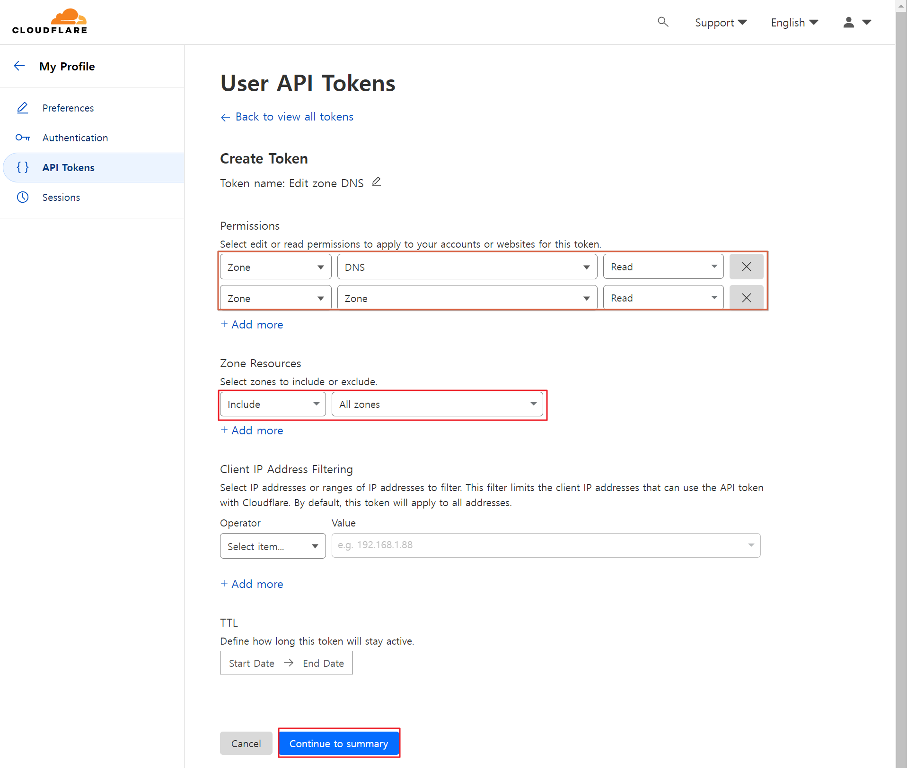

# What is this program?
As a manager of CloudFlare Service. There are many record items to protect services.

But Maintanence is very hard to optimize. It may neccessary to check it live, dead or activated with cloudflare.

To do this, you can reduce the number of manual DNS lookups

I hope it useful to your management.
Thank you.


# installation
## MANUAL
Install all modules
```bash
$ npm i
```

Build Next.js project
```bash
$ npm run build
```

Run Next.js Server
```bash
$ npm run start
```

Init Database
```bash
$  npx prisma db push
```

Access Server
```bash
http://localhost:3000
```

# Guide Line

1. Get api key
   

2. Change API key to load domain and records information


3. functions
   When click one domain. You can see registerd A, CNAME records.
   It indicates 3 types about current status.

Server Icon - CloudFlare Record has been registered but connectied to direct access.

CloudFlare Icon - This Server is connected by CloudFlare Service

None(X) Icon - There is no information about that record


### Etc. CloudFlare IP range filter
```javascript
const IP_RANGES: string[] = [
"173.245.48.0/20",
"103.21.244.0/22",
"103.22.200.0/22",
"103.31.4.0/22",
"141.101.64.0/18",
"108.162.192.0/18",
"190.93.240.0/20",
"188.114.96.0/20",
"197.234.240.0/22",
"198.41.128.0/17",
"162.158.0.0/15",
"104.16.0.0/13",
"104.24.0.0/14",
"172.64.0.0/13",
"131.0.72.0/22",
];

// source : cloudflare official ip range
```